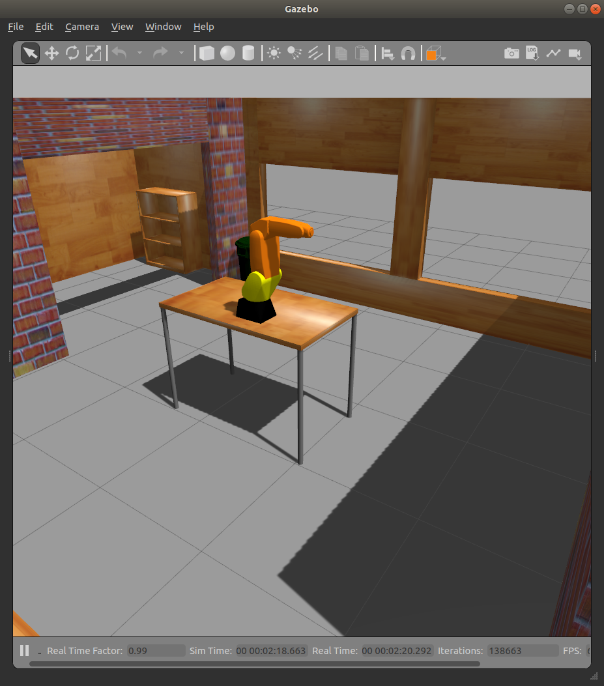
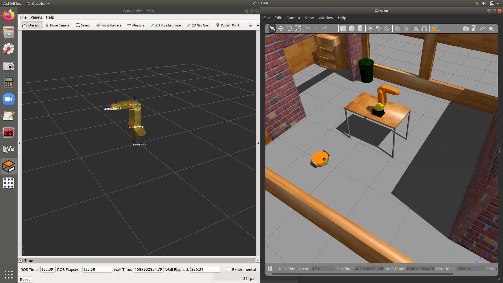
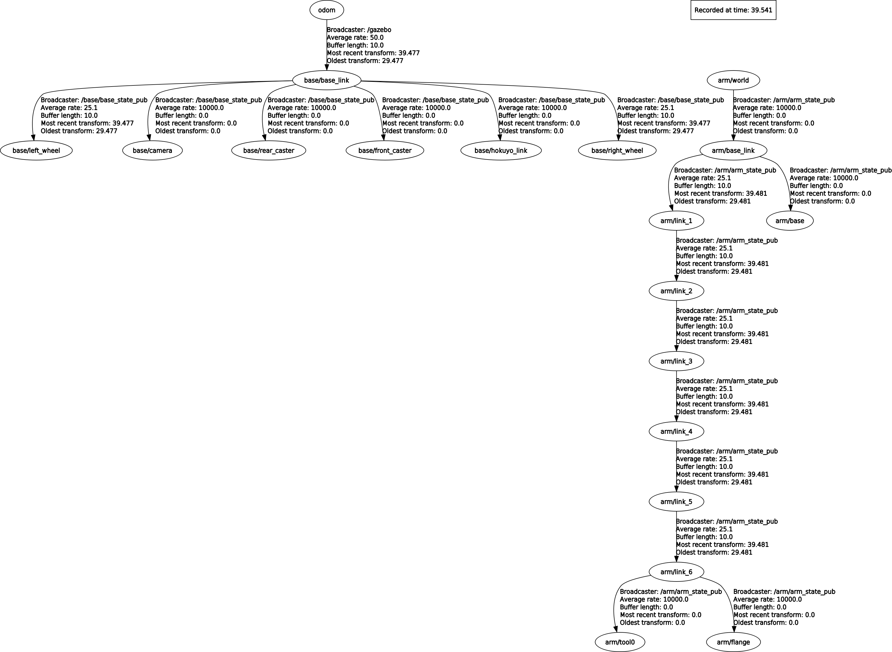

# Configuration of Fanuc 200ic for gazebo
This package contains all the configs and launch files to run Fanuc arm in gazebo simulation. 
Fanuc (like many other industrial robot manufacturers) do not give all the inertia values and transmission setup to directly
spawn their URDF file in your Gazebo. You have to download their URDFs and set them manually. Here I put some inertia values to bring up the simulation 

You can use this package to learn,
 - JointTrajectoryController and JointStateController for the robot arm
 - plugin gazebo_ros_control when you use different name for robot_description
 - how to use groups,tf_prefix and --namespace correctly to spawn more than one robot
 
Spawning more than one robot with different robot_descriptions is difficult.
You can use the fanuc_and_base.launch file to get a good idea about that.

## fanuc_on_table.launch (Single Fanuc arm fixed to the table)

## fanuc_and_base.launch (Fanuc arm and base_robot both in the house)

## Dependencies
 - [base_robot](https://github.com/IsuruKalhara/ros_gazebo_base_model)
 - [turtlebot3_simulations](https://github.com/ROBOTIS-GIT/turtlebot3_simulations) (for the gazebo world file model)
 - may be more..
